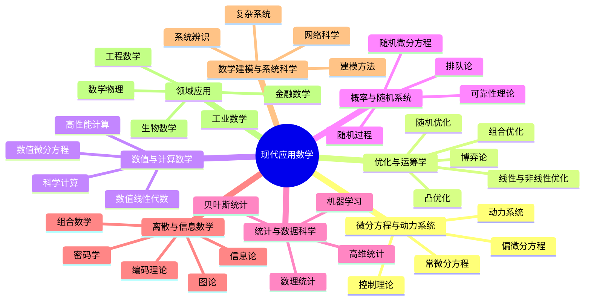

# 现代应用数学分类
copy from ChatGPT

现代应用数学没有唯一统一的分类，因为许多方向彼此交叉。按照现代大学院系和研究领域，通常可以分成下面几大类：

### 1. 微分方程与动力系统

研究连续变化的系统。

- 常微分方程
- 偏微分方程
- 动力系统
- 分岔与混沌
- 控制理论
- 反问题

典型应用包括流体、热传导、电磁场、人口模型、传染病模型和自动控制。

### 2. 优化与运筹学

研究如何在约束条件下作出最优决策。

- 线性规划
- 非线性规划
- 凸优化
- 整数规划与组合优化
- 随机优化
- 多目标优化
- 最优控制
- 博弈论
- 排队论与调度理论

你之前问到的**凸优化**，通常就处在：

$$
\text\{应用数学\}
\supset
\text\{优化理论\}
\supset
\text\{凸优化\}
$$

在课程设置中，优化往往归入应用数学、运筹学、控制科学、计算机科学或管理科学。

### 3. 数值分析与科学计算

研究如何利用计算机近似求解数学问题。

- 数值线性代数
- 数值积分与插值
- 数值微分方程
- 有限差分法
- 有限元法
- 谱方法
- 科学计算
- 高性能计算

它与微分方程、优化、机器学习联系都非常紧密。

### 4. 概率论与随机系统

研究含有随机性的现象。

- 概率论
- 随机过程
- 马尔可夫链
- 随机微分方程
- 随机控制
- 排队论
- 可靠性理论
- 随机网络

应用于金融、通信、物理、生物和风险管理等领域。

### 5. 统计学与数据科学

研究如何由数据进行推断、预测和决策。

- 数理统计
- 参数与非参数统计
- 贝叶斯统计
- 时间序列
- 高维统计
- 因果推断
- 统计学习
- 机器学习

严格来说，统计学在现代大学中经常作为独立学科，但从广义上也属于应用数学体系。

### 6. 离散数学与信息科学

研究离散结构及其计算和信息问题。

- 图论
- 组合数学
- 组合优化
- 算法理论
- 编码理论
- 密码学
- 信息论
- 网络科学

它处在数学、计算机科学和通信工程的交界处。

### 7. 数学建模与系统科学

这一方向强调把现实问题转化成数学问题。

- 数学建模
- 系统分析
- 复杂系统
- 多智能体系统
- 网络动力学
- 系统辨识
- 不确定性量化
- 仿真与预测

数学建模本身通常不是一套独立数学理论，而是综合使用微分方程、概率、统计、优化和计算方法。

### 8. 按应用对象形成的交叉方向

这些领域主要按照“数学应用在哪里”来分类：

| 方向 | 主要使用的数学 |
|---|---|
| 数学物理 | 微分方程、几何、泛函分析 |
| 工业数学 | 建模、优化、数值计算 |
| 金融数学 | 概率、随机过程、偏微分方程 |
| 生物数学 | 动力系统、概率、统计 |
| 医学数学 | 成像、反问题、统计 |
| 计算材料学 | 偏微分方程、数值分析 |
| 气候数学 | 流体方程、动力系统、科学计算 |
| 网络科学 | 图论、概率、动力系统 |
| 人工智能数学 | 优化、概率、统计、线性代数 |
| 量子信息 | 线性代数、概率、信息论 |

可以将现代应用数学的核心结构概括为：

$begin:math:display$
\\boxed\{
\\text\{现实问题\}
\\longrightarrow
\\text\{数学建模\}
\\longrightarrow
\\text\{分析与优化\}
\\longrightarrow
\\text\{数值计算\}
\\longrightarrow
\\text\{数据验证\}
\}
$end:math:display$

其中最基础、最通用的几根支柱是：

$begin:math:display$
\\boxed\{
\\text\{微分方程\}
\+\\text\{概率统计\}
\+\\text\{优化\}
\+\\text\{数值计算\}
\+\\text\{离散数学\}
\}
$end:math:display$

而线性代数、分析学、概率论、泛函分析等基础数学，则为这些应用方向提供理论工具。很多现代领域——例如机器学习、控制理论和反问题——实际上同时横跨其中多个分类。