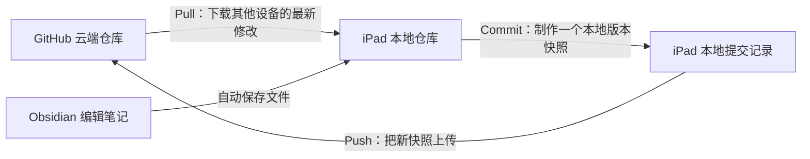

先记住一句话：

Pull 是“先取回来”，Commit 是“在本机留快照”，Push 是“把快照上传”。

三个动作分别是什么意思

1. Pull：从 GitHub 拉取最新内容

Pull 的方向是：

GitHub → iPad

例如，你昨天在 Mac 上修改了笔记并上传到了 GitHub。今天打开 iPad 时，iPad 里还是旧版本。此时在 Working Copy 中执行 Pull，就会把 Mac 上传的修改下载到 iPad。

因此，最好养成这个习惯：

开始编辑前，先 Pull。

Pull 并不会删除你的笔记。它会尝试把 GitHub 上的修改和 iPad 上的修改合并起来。

技术上，Pull 通常包括两个动作：

- Fetch：检查并下载 GitHub 上的新提交。
- Merge：把这些提交合并到本地文件。

Working Copy 通常会帮你一起完成，不需要分别操作。

  

2. Commit：在 iPad 上保存一个版本快照

Commit 可以理解为：

“把当前这些修改登记成一个正式版本，并写一句说明。”

例如你修改了三篇笔记，然后提交：

补充8月19日会议记录

这次 Commit 会记录：

- 哪些文件被修改了；
- 增加了哪些内容；
- 删除了哪些内容；
- 修改时间；
- 你的提交说明。

但是，Commit 只保存在 iPad 的本地 Git 仓库里，并没有上传到 GitHub。

所以：

- Obsidian 保存：只是保存当前文件。
- Commit：把当前修改制作成可追溯的版本快照。
- 两者不是同一件事。

你可以连续做多个 Commit，之后再一次性 Push。

  

3. Push：把本地 Commit 上传到 GitHub

Push 的方向是：

iPad → GitHub

只有 Commit 过的内容才能正常 Push。

例如：

1. 在 Obsidian 修改笔记；
2. 回到 Working Copy；
3. Commit，说明写“新增读书笔记”；
4. Push；
5. GitHub 上才会出现这个新版本。

因此，单独 Commit 后去 GitHub查看，可能什么都没有变化——因为它还只存在于 iPad 上。

每天正确的同步顺序

推荐始终按照下面的顺序：

开始写之前

1. 打开 Working Copy。
2. 选择 Obsidian 仓库。
3. 点 Pull。
4. 确认没有冲突。
5. 再打开 Obsidian 写笔记。

写完之后

1. 等待 Obsidian 保存完成。
2. 最好暂时切出或关闭 Obsidian。
3. 打开 Working Copy。
4. 查看有哪些文件发生变化。
5. 点 Commit。
6. 填写简短说明，例如：

更新今天的日记

7. Commit 完成后点 Push。
8. 等待上传成功。

完整顺序就是：

Pull → Obsidian 编辑 → Commit → Push

举一个完整例子

假设 GitHub 上目前有一篇笔记：

旅行计划.md

你在 iPad 上增加酒店信息。

首先执行 Pull，确保拿到其他设备的最新版本。然后在 Obsidian 中修改：

酒店：上海静安酒店

Obsidian 自动保存了文件，但此时：

- iPad 文件已经改变；
- GitHub 还没有改变。

接着在 Working Copy 中 Commit：

补充上海酒店信息

此时：

- iPad 已经拥有一个新的版本快照；
- GitHub 仍然是旧版本。

最后执行 Push：

- 新的 Commit 被上传；
- GitHub 才会显示最新酒店信息；
- Mac 下次执行 Pull 后，也能获得这个修改。

为什么一定要先 Pull

假设发生下面的情况：

1. Mac 修改了“旅行计划.md”并 Push。
2. iPad 没有 Pull，仍然是旧版本。
3. 你又在 iPad 修改同一段内容。
4. iPad Commit 后再 Push。

这时 GitHub 可能拒绝 Push，因为云端已经有了 iPad 不知道的新版本。你需要先 Pull，并处理可能出现的冲突。

因此最安全的原则是：

哪个设备准备开始编辑，哪个设备就先 Pull；编辑完成后 Commit，再 Push。

另外，GitHub 同步不像 iCloud 那样完全自动。如果 Working Copy 中有 Sync 按钮，它通常会依次检查远端更新、合并并上传，但初学时分别使用 Pull → Commit → Push 更容易看清每一步。[Working Copy 官方说明](https://workingcopy.app/manual/file-backup/)