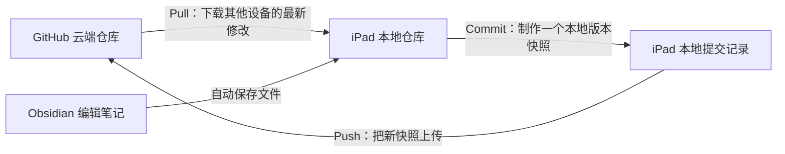

这里用到了“函数振幅”这个概念。

> [!note]- 点击查看“函数振幅”的解释
> 函数 \(f\) 在点 \(x\) 处的振幅定义为……

```mermaid
flowchart LR
    A["GitHub 云端仓库"] -->|"Pull：下载其他设备的最新修改"| B["iPad 本地仓库"]
    C["Obsidian 编辑笔记"] -->|"自动保存文件"| B
    B -->|"Commit：制作一个本地版本快照"| D["iPad 本地提交记录"]
    D -->|"Push：把新快照上传"| A
```

> [!tldr] 定理
> Contents

[^1]

[^1]: 呜呜呜呜
