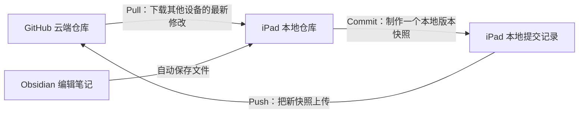
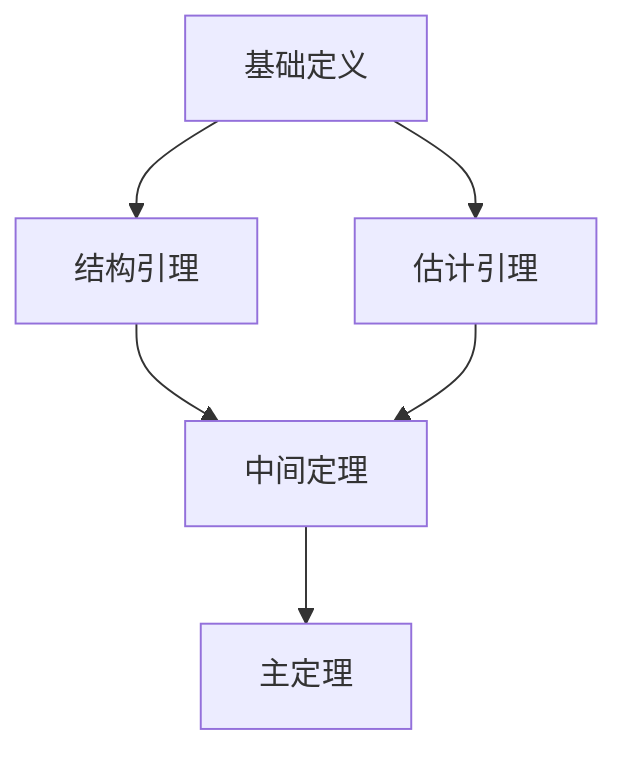
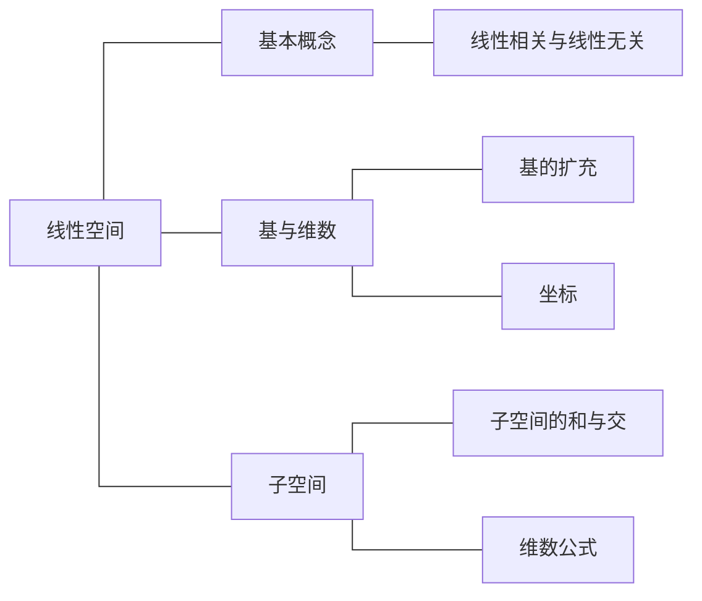

---
cssclasses:
  - horizontal-table
---

这里用到了“函数振幅”这个概念。

> [!note]- 点击查看“函数振幅”的解释
> 函数 \(f\) 在点 \(x\) 处的振幅定义为……

> [!cite] 定理
> Contents

[^1]

---

---

| 阶段 | 教材位置 | 内容框架与要解决的问题 | 初学应掌握的程度 |
| :--- | :--- | :--- | :--- |
| **1. 非负函数的积分** | §2.2 | 建立非负可测函数的积分；学习单调收敛定理、Fatou 引理。 | 理解积分定义，掌握定理的条件与结论。 |
| **2. 实值、复值函数的积分** | §2.3 | 建立可积性；学习控制收敛定理。 | 掌握可积性判断及极限与积分交换。 |

$$
    \text{整体结论不成立}推特
$$

$$
    \vphantom{\frac{A}{A}}\text{整体结论不成立}
$$

$$
    {\small \text{整体结论不成立}} \Longrightarrow {\small \text{选出一列反例}} \Longrightarrow {\small \text{提取收敛子列}} \Longrightarrow {\small \text{在极限点使用局部条件}}
$$

| 编号 | 知识主题 | 研究对象 | 核心概念 | 常用工具 | 典型问题 | 证明思路 | 常见误区 | 练习重点 | 复习目标 | 测试终点 |
|---|---|---|---|---|---|---|---|---|---|---|
| 01 | 数列极限 | 实数数列 | 收敛与发散 | 单调有界定理 | 判断数列是否收敛 | 先证单调，再证有界 | 有界不一定收敛 | 递推数列与子列 | 熟练使用极限定义 | 已看到最右侧 ✓ |
| 02 | 函数连续 | 实变量函数 | 连续与一致连续 | 闭区间连续函数定理 | 判断是否一致连续 | 分析定义或构造反例 | 连续不一定一致连续 | 开区间与无穷区间 | 区分两种连续性 | 已看到最右侧 ✓ |
| 03 | 函数列 | 一列实值函数 | 点态与一致收敛 | 上确界判别法 | 能否交换极限与积分 | 估计整体误差上界 | 点态收敛不一定一致收敛 | 求极限函数与误差 | 掌握一致收敛判别 | 已看到最右侧 ✓ |
| 04 | 函数项级数 | 函数的无穷求和 | 部分和与余项 | M 判别法 | 判断级数是否一致收敛 | 寻找可求和的统一上界 | M 判别失效不代表不一致收敛 | 余项估计与端点分析 | 正确选择判别方法 | 已看到最右侧 ✓ |
| 05 | 线性变换 | 有限维线性空间 | 核、像与表示矩阵 | 秩与零度定理 | 求核与像的维数 | 转化为线性方程组 | 混淆向量与坐标 | 基的选择与矩阵表示 | 理解空间与矩阵的联系 | 已看到最右侧 ✓ |

$$
	饿
$$

点击展开详细内容

这里是需要折叠的第一段文字。

这里是第二段文字。

[^1]: 呜呜呜呜

